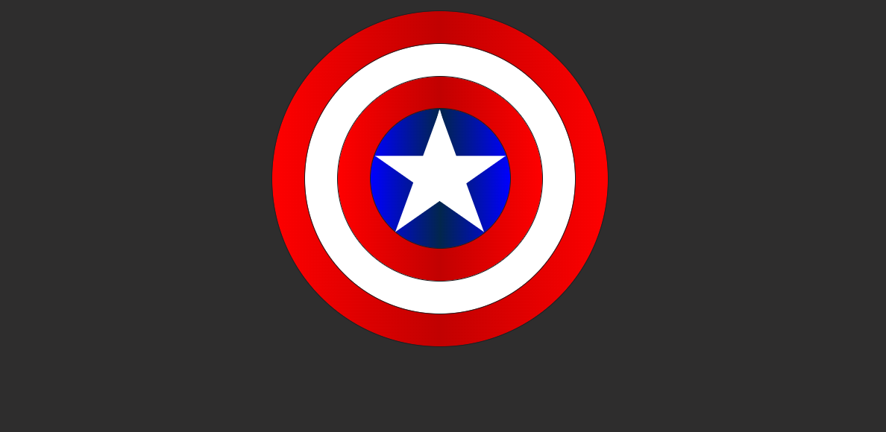

# Escudo_Capitao_America_HTML_CSS
#Construção simples do HTML com 5 
s.
#Estilização em css através das 'class' dado forma com atribuições de valores as margens, bordas, alinhamento e criação das variáveis de cores de degradê.
#Com os 'ids' foi feito a manipulação das cores e os tamanhos de cada 'div'.
